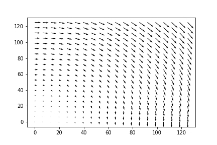
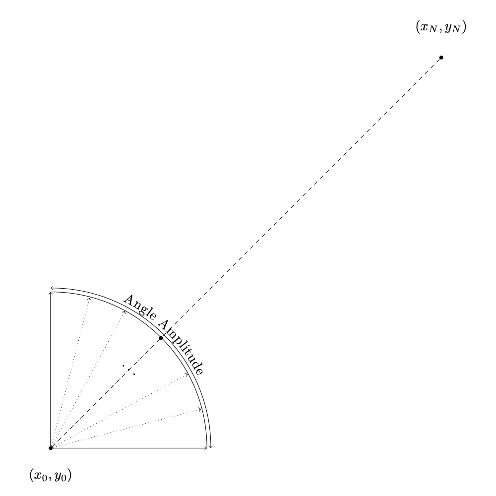

<!-- README template: https://github.com/othneildrew/Best-README-Template -->

<!-- PROJECT SHIELDS -->
<!--
*** I'm using markdown "reference style" links for readability.
*** Reference links are enclosed in brackets [ ] instead of parentheses ( ).
*** See the bottom of this document for the declaration of the reference variables
*** for contributors-url, forks-url, etc. This is an optional, concise syntax you may use.
*** https://www.markdownguide.org/basic-syntax/#reference-style-links
-->
[![Contributors][contributors-shield]][contributors-url]
[![Forks][forks-shield]][forks-url]
[![Stargazers][stars-shield]][stars-url]
[![Issues][issues-shield]][issues-url]

<!-- PROJECT LOGO -->
<br />
<p align="center">
  <a href="https://github.com/ShrimpyLouis">
    
  </a>
</p>


<!-- TABLE OF CONTENTS -->
<details open="open">
  <summary>Table of Contents</summary>
  <ol>
    <li>
      <a href="#about-the-project">About The Project</a>
      <ul>
        <li><a href="#structure">Structure</a></li>
        <li><a href="#contributing">Contributing</a></li>
      </ul>
    </li>
    <li>
      <a href="#getting-started">Getting Started</a>
      <ul>
        <li><a href="#install-dependencies">Install dependencies</a></li>
        <li><a href="#add-dependencies">Add dependencies</a></li>
      </ul>
    </li>
    <li>
    <a href="#library">Library</a>
    <ul>
        <li><a href="#vector-fields">Vector fields</a></li>
        <li><a href="#jax-utils">JAX utils</a></li>
        <li><a href="#tf-utils">TF utils</a></li>
        <li><a href="#web">Web</a></li>
      </ul>
    </li>
    <li><a href="#demo">Demo</a></li>
    <li><a href="#contact">Contact</a></li>
    <li><a href="#acknowledgements & references">Acknowledgements & References</a></li>
  </ol>
</details>

# About the Project

This is an ocean vessel path finding algorithm that optimizes fuel consumption and travel time between destinations. We achieve this by combining the locally optimal solution found by the classic Zermelo's Navigation Problem and applies a discretized Jacobi-Newton method for path smoothing and global optimization.


## Structure

The repository is structured into the following directories:

- `/hybrid_routing`: where the python code is.


## Contributing

Conveniently, a set of workflows via Github actions are already installed:

- `black`: Code styling & formatting.

In addition, all docstrings shall be in the numpy format.

# Getting Started

This package is purely written in Python and it depends on [Scipy](https://scipy.org/), [Numpy](https://numpy.org/), and Google's [JAX](https://github.com/google/jax) with their dependencies. 
All packages and dependencies are listed in [requirements.txt](./requirements.txt).

## Install dependencies

There are two install options, we recommend installing an environment using [`conda`](https://docs.conda.io/en/latest/miniconda.html#installing). However it would work with a regular `pip` install.

- Conda: 
  ```
  conda env create -f environment.yml --force
  ```
  Make sure to activate the conda environment once installation is finished.
- Pip: 
  ```
  pip install -r requirements.txt
  pip install -e .[dev]
  ```

you can also use `make install`.

The difference between `conda` and `pip` is that conda will create an isolated environment while pip will install all the dependencies in the current Python env. This might be a conda environment or any other Python env created by other tools. If you already have the dependencies installed, you can update it to reflect the last version of the packages in the `requirements.txt` with `pip-sync`. 

## Add dependencies

Add abstract dependency to `setup.py`. If neccessary, add version requirements but try to be as flexible as possible

- Update `requirements.txt`: `pip-compile --extra dev > requirements.txt`
- Update environment: `pip-sync`

# Library

The library is structured as follows.

### Vector Fields

The module [hybrid_routing.vectorfields](./hybrid_routing/vectorfields/) contains all the different `Vectorfield` classes used in our study. Each `Vectorfield` implements a synthetic field of sea currents.

Sample code to use vectorfields:

```python
from hybrid_routing.vectorfields import Circular

# Initialize the vectorfield
vectorfield = Circular()

# Get the current velocity (u, v) at point (x, y)
# x = longitude, y = latitude
x, y = 0.5, 0.2
# u = velocity vector component parallel to longitude
# v = velocity vector component parallel to latitude
u, v = vectorfield.get_current(x, y)

# Plot the vectorfield
vectorfield.plot()
```

Here is the expected plot output:



### JAX Utils

The module [hybrid_routing.jax_utils](./hybrid_routing/jax_utils/) implements all the functions to optimize a route by using JAX.

Example and set up of `optimize_route`:
```python
  from hybrid_routing.jax_utils.optimize import optimize_route
  from hybrid_routing.vectorfields import NoCurrent
  import numpy

  # We must provide the following parameters:
  #   vectorfield, (x_start, y_start), (x_end, y_end)

  vectorfield = NoCurrent()
  x_start, y_start = 0, 0
  x_end, y_end = 10, 10

  # The following parameters are optional, but we recommend
  # you test them out:
  #   time_max, time_step, angle_amplitude,
  #   num_angles, vel, dist_min

  time_max, time_step = 5, 0.5
  angle_amplitude, num_angles = np.pi/2, 6
  vel, dist_min = 2.5, 1

  # invoking optimize route function:
  list_routes = optimize_route(
    vectorfield, 
    x_start, y_start, 
    x_end, y_end, 
    time_max = time_max, time_step = time_step, 
    angle_amplitude = angle_amplitude, num_angles = num_angles, 
    vel = vel, dist_min = dist_min)

  # "list_routes" contains all paths as entries orginates
  # from (x_start, y_start), each entry is a list of points
  # (x, y, theta). It has the same length as time_max / 
  # time_step, and there are "num_angles" amount of entries.
  # The path that brings us closest to (x_end, y_end) is
  # the first entry, as we are printing below:
  print(list_routes[0])
```

The diagram below illustrates the setup: \
(x0, y0) = `(x_start, y_start)`,\
(xN, yN) = `(x_end, y_end)`.



### TF Utils

This module is not used right now. Avoid calling it.

The module [hybrid_routing.tf_utils](./hybrid_routing/tf_utils/) implements all the functions to optimize a route by using TensorFlow.

### Web

```
---SECTION UNDER CONSTRUCTION---
```
The module [hybrid_routing.web](./hybrid_routing/web/) contains the utils used to deploy our demo. You can learn more about this in our [demo section](#demo).

## Demo

With the `hybrid-routing` environment active, you can initialize the web application by running the following command:

```
streamlit run hybrid_routing/demo.py --server.port 8501
```

The demo will start at port 8501 (you can change the port to anyone you prefer). Then you can access the web in your PC by going to http://localhost:8501

## Contact

Official website: https://smartshipping.es/

Robert Milson - rmilson@dal.ca

Project link: [https://github.com/ShrimpyLouis/hybrid_ivp](https://github.com/ShrimpyLouis/hybrid_ivp)

## Acknowledgements & References
* [Louis Bu](https://github.com/ShrimpyLouis/)
* [Daniel Precioso](https://www.linkedin.com/in/daniel-precioso-garcelan/)
* [Robert Milson](https://www.dal.ca/faculty/science/math-stats/faculty-staff/our-faculty/mathematics/robert-milson.html)
* [Zermelo Navigation Problem](https://en.wikipedia.org/wiki/Zermelo's_navigation_problem)
* [Parallel iterative methods for variational integration applied to navigation problems](https://arxiv.org/abs/2109.05559)
* [Google: JAX](https://github.com/google/jax)
<!-- MARKDOWN LINKS & IMAGES -->
<!-- https://www.markdownguide.org/basic-syntax/#reference-style-links -->
[contributors-shield]: https://img.shields.io/github/contributors/ShrimpyLouis/hybrid_ivp.svg?style=for-the-badge
[contributors-url]: https://github.com/ShrimpyLouis/hybrid_ivp/graphs/contributors
[forks-shield]: https://img.shields.io/github/forks/ShrimpyLouis/hybrid_ivp.svg?style=for-the-badge
[forks-url]: https://github.com/ShrimpyLouis/hybrid_ivp/network/members
[stars-shield]: https://img.shields.io/github/stars/ShrimpyLouis/hybrid_ivp.svg?style=for-the-badge
[stars-url]: https://github.com/ShrimpyLouis/hybrid_ivp/stargazers
[issues-shield]: https://img.shields.io/github/issues/ShrimpyLouis/hybrid_ivp.svg?style=for-the-badge
[issues-url]: https://github.com/ShrimpyLouis/hybrid_ivp/issues
